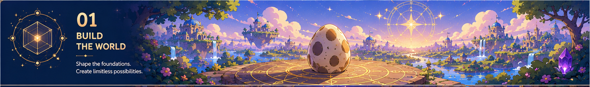
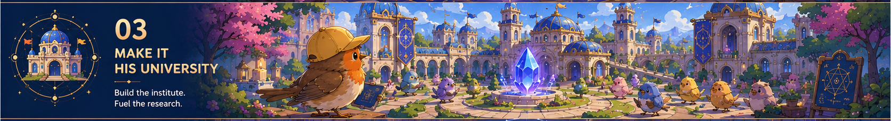

# Open Research Network

A modern LLM in a datacenter consumes between 10,000 and 20,000 watts to answer a simple question. Every other human — including Einstein and Von Neumann — runs on 20 watts, and if you ask them something, they generate a precise model of the world at whatever resolution the question requires.

The difference isn't raw computation. It's grounding. Agents hallucinate because they have no stable model of reality to verify against. As the internet of agents grows, the problem compounds: without shared geometric representations of reality, agents can't be made efficient, can't communicate reliably, and can't be trusted to reason about the same world.

We're building that grounding layer. A brain needs two things: a model of itself and a model of the world. This project builds both, starting from the geometric framework in the [published research](https://github.com/faltz009/whitepapers) and working toward a navigable, shared world that any agent or researcher can locate themselves in.

The theory is done. The demos exist. What follows is the build.

---

## 01 — Build The World

Bootstrap the geometric landscape: concepts, sources, arguments, and relationships as structured carriers on S³, so that different vocabularies can point to the same underlying structure and proximity means something real.

**Live demos:**

- **[Thought Engine](https://faltz009.github.io/open-research-network/draw.html)** — a compact rule unfolds into a visible shape; continuous-to-discrete sampling in the browser
- **[Shape Field](https://faltz009.github.io/open-research-network/field.html)** — a signal enters a field and the field reorganizes; static shapes and motion from the same operation
- **[Egregore Wars](https://faltz009.github.io/open-research-network/defender-loop.html)** — a minimal social field where an agent learns which groups restore or drain signal, then acts on that

---

## 02 — Teach Defender

Give the world a point of view. Defender's archive, values, attention, and style become the identity layer that turns a geometric landscape into a perspective — a mind that can read new material, locate it in the existing structure, and answer from within the world rather than about it.

Reading becomes imagination. Questions become navigation. Corrections sharpen the model.

---

## 03 — Make It His University

Researchers, collaborators, critics, and schools of thought become positions in the same landscape. The map shows who works near whom, which debates are connected, and where different fields are touching the same underlying structure without knowing it.

This is the Open Research Institute: public knowledge infrastructure where the frontier is visible because the whole territory is mapped.

---

## 04 — Build The Network

People bring their own identities into the map. Researchers verify their work, locate themselves in the shared landscape, contribute sources, and build relationships through the human verification layer.

Defender's Brain becomes one public mind-world inside the larger Open Research Network — a demonstration that the architecture works before opening it to everyone.

---

## Technical Substrate

- **Closure SDK / Closure EA** — carrier algebra, closure, memory, resonance, and learning on S³ · [github.com/faltz009/Closure-SDK](https://github.com/faltz009/Closure-SDK)
- **Whitepapers** — the published theory behind the geometric computer · [github.com/faltz009/whitepapers](https://github.com/faltz009/whitepapers)
- **Open Research Institute** · [x.com/OpenResearchOrg](https://x.com/OpenResearchOrg)
- **DefenderOfBasic** · [x.com/DefenderOfBasic](https://x.com/DefenderOfBasic)
