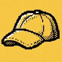

# PAGE IS A WORK IN PROGRESS

  

# Defender's Brain

*A public mind needs a world.*

Defender's Brain is the first public mind-world for Universal Public Defender, a
navigable landscape of concepts, sources, arguments, researchers, and
relationships shaped around a real public identity.

The Open Research Network is the larger version of that idea: public knowledge
infrastructure for researchers, built as a shared world where ideas have
positions and people have neighborhoods, and understanding is learning how to
move through the map.

## Live Demos

- **[Thought Engine](https://faltz009.github.io/open-research-network/draw.html)**  
  A compact rule unfolds into a shape. The demo shows continuous-to-discrete
  sampling: the same construction can be drawn with a few points or many points.

- **[Shape Field](https://faltz009.github.io/open-research-network/field.html)**  
  A signal enters a 3D + time field and the field reorganizes into different
  forms. The same idea that draws a static shape can drive motion.

Live site: **[faltz009.github.io/open-research-network](https://faltz009.github.io/open-research-network/)**

## What We Are Building

Defender's Brain begins with Defender's World: a topological map of human
knowledge shaped by Defender's writing, arguments, current attention, taste, and
public relationships. Concepts in that world have positions, shapes, neighbors,
sources, and behavior, so different vocabularies can point toward the same
structure and researchers can be near each other because their work touches the
same region.

Defender's Mind is the identity that learns to perceive, read, and act inside
that world.

## Roadmap

### 1. Build Defender's World

Bootstrap the landscape: concepts, sources, arguments, relations, and geometric
states, forming the world a mind can perceive before it can answer from within
it.

The current demos are early public handles for this layer: Thought Engine shows
how rules become shapes, while Shape Field shows how signals can reorganize a
field over space and time.

### 2. Give The World An Identity

Defender's archive, values, current attention, style, and alignment give the
world a point of view. Reading becomes imagination as new material enters the
world, activates existing structures, closes new relations, and changes what
Defender's Mind can perceive.

### 3. Add Other Minds And Relationships

Researchers, collaborators, critics, schools of thought, and intellectual
communities become positions in the same landscape. The map can show who works
near whom, which debates are connected, and where different fields are touching
the same underlying structure.

### 4. Teach Through The World

Questions become a way to enter the landscape: a question activates a region of
the world, Defender's Mind follows the shape, and the answer is translated back
into language with sources, maps, and correction.

Here, asking Defender becomes teaching Defender: questions, corrections,
and source contributions sharpen the verified world model.

### 5. Open The Network

People bring their own identities into the map as researchers verify their work,
locate themselves in the shared landscape, contribute sources, and build
relationships through the human verification layer.

Defender's Brain becomes one public mind-world inside the larger Open Research
Network.

## Open Research Network

The network holds a collective understanding of ideas and the people working on
them, connecting concepts across disciplines and situating researchers in the
intellectual neighborhoods their work defines. As knowledge accumulates as
living structure, the frontier becomes visible.

- A shared, navigable field of concepts where ideas unfold as geometric states.
- Researchers placed by what they work on, so intellectual neighborhoods become visible.
- Questions that teach by guiding people through the shape of understanding.
- A map of who is researching what, and where the frontier is moving.
- Built openly by the Open Research Institute as public knowledge infrastructure.
- Designed for the internet of agents, minds, and verified human identity.

## Technical Substrate

The underlying research lives in the geometric computer stack:

- **Closure SDK / Closure EA** — carrier algebra, closure, memory, resonance, and learning on S³  
  [github.com/faltz009/Closure-SDK](https://github.com/faltz009/Closure-SDK)

- **Open Research Institute**  
  [x.com/OpenResearchOrg](https://x.com/OpenResearchOrg)
